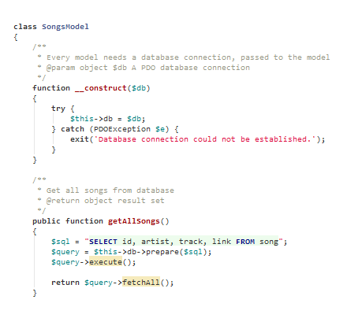

#phpstorm-theme-github-remixed

Get GitHub's syntax highlighting / colours and fonts within PHPStorm.

### Installation on Windows (PHPStorm 7)

Close PHPStorm if open.
Go to `C:\Users\XXXXXX\.WebIde70\config\colors` and place the .icls file there.
Open PHPStorm, go to *View -> Quick Switch Theme -> Switch Color Scheme* and select *GitHub Remixed*.

### Installation on Mac OS (PHPStorm 7)

TODO

### Installation on Linux (PHPStorm 7)

Same as above, but path is for sure `~/Library/Preferences/WebIde70/colors`.